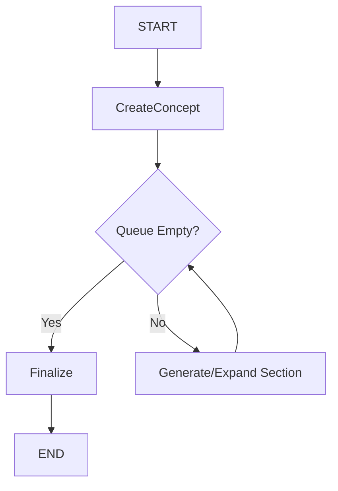

# Generator Agent

The generator builds a fictional city corpus using a **Fractal Expansion** strategies over a LangGraph state machine. It parses the "World Bible" prompt (`docs/agents/sample_prompt.md`) to establish detailed categories, then recursively expands each category into sub-sections to achieve high word counts (target: ~200k words).

---

## Architecture

### Fractal Generation Strategy
Instead of writing broad summaries, the agent uses a **Depth-First Expansion** approach:

1.  **Parse**: Loads 22+ high-level categories (Geography, Economy, The Underbelly, etc.) from `sample_prompt.md`.
2.  **Concept**: Generates the core city identity (Name, Vibe, Conflict).
3.  **Route & Expand**:
    *   If a section is a **Category** (e.g., "Architecture"): The agent calls the LLM to break it down into 5-8 atomic "scenes" or "sub-chapters" (e.g., "The Slum Skyline", "The Crystal Palaces", "Bridge Mechanics").
    *   These sub-chapters are prepended to the work queue.
4.  **Write**: The agent writes a detailed (2k-3k word) entry for each sub-chapter, referencing the parent category for context.

---

## State Diagram

*Note: The `Generate` node handles both expansion (adding new items to queue) and writing (generating text).*

---

## Configuration

| Environment Variable | Description |
|----------------------|-------------|
| `OPENAI_MODEL`       | LLM Model (default: `gpt-4`) |
| `target_words`       | Goal for corpus size (default: 200,000) |

## Output
- `corpus/city_corpus.txt`: The full compiled Markdown bible.
- `corpus/corpus_metadata.json`: Stats on word count and sections.
